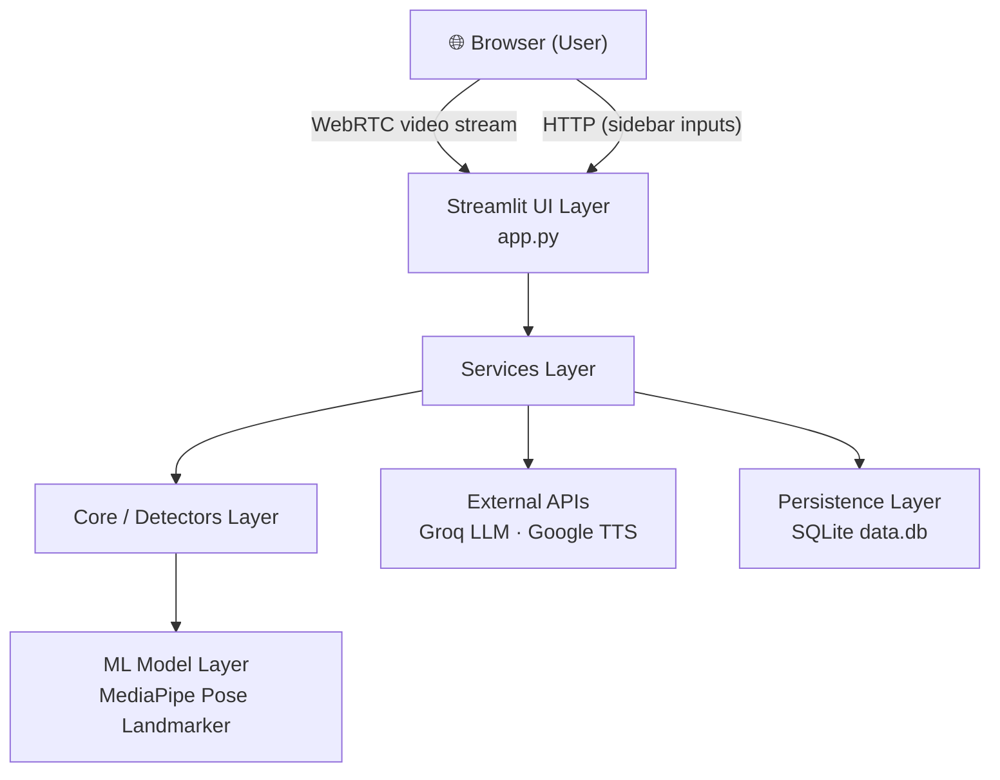
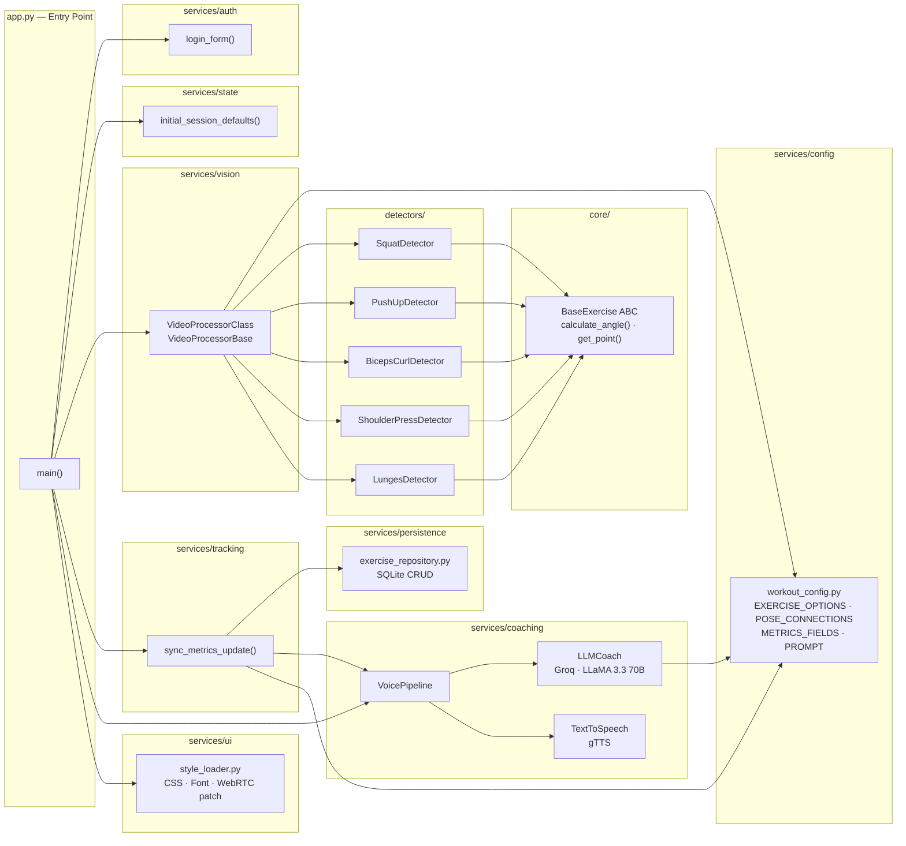
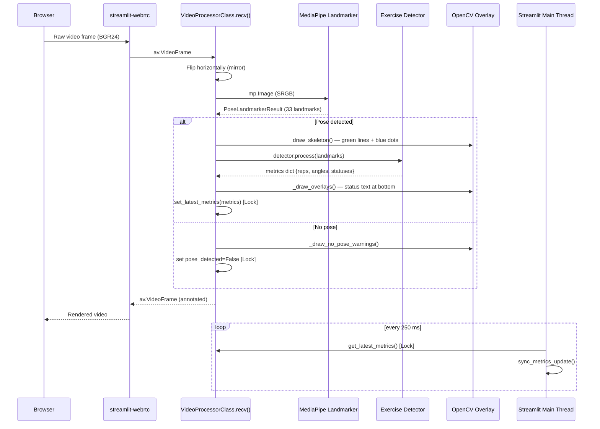
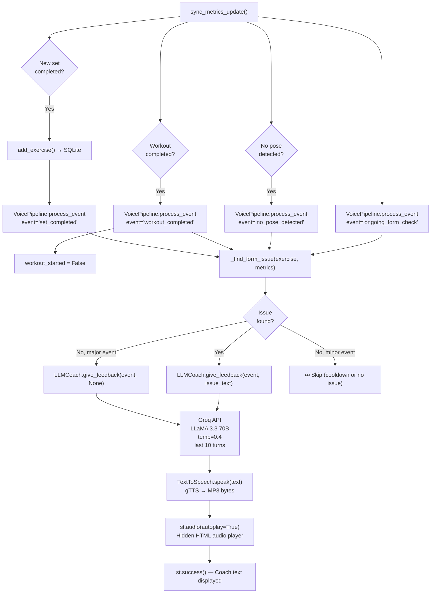
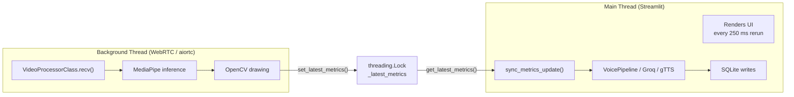
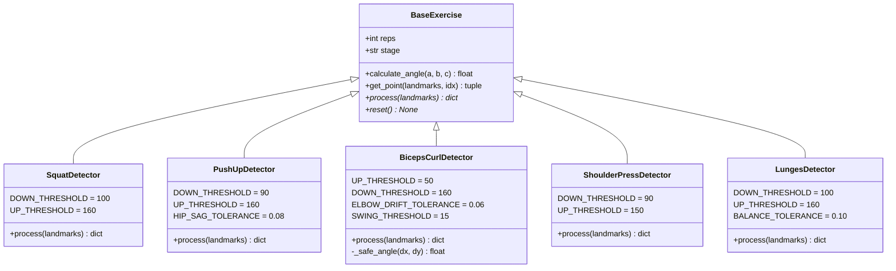
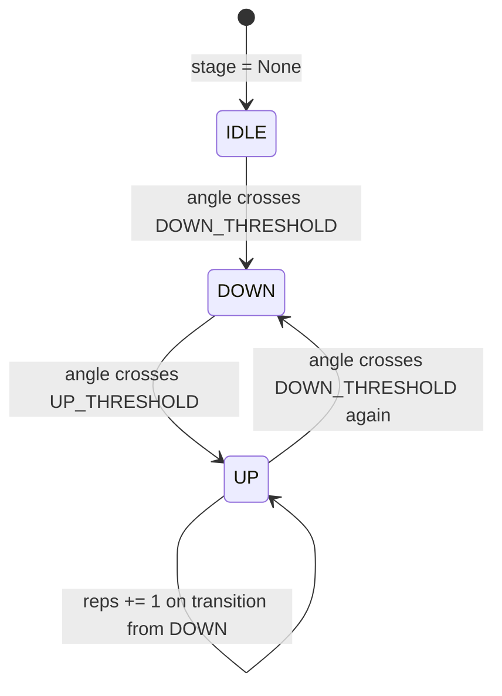
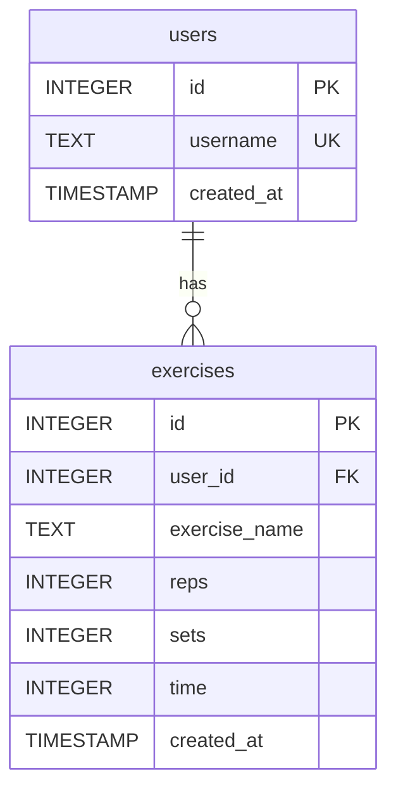
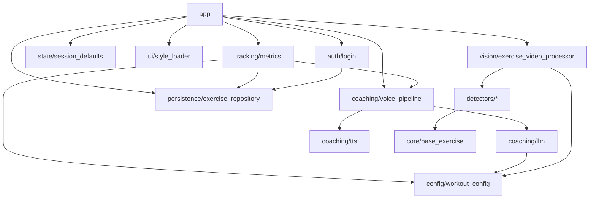

# GymGenie — System Architecture

## 1. High-Level Architecture

GymGenie is a single-process Streamlit application composed of six conceptual layers. Each layer has a single, well-defined responsibility.



---

## 2. Component Map



---

## 3. Per-Frame Data Flow

Every frame from the user's webcam passes through this pipeline:



---

## 4. AI Coaching Event Flow



---

## 5. Threading Model



> **Key design decision**: All heavy ML inference (MediaPipe) runs in the WebRTC background thread. The Streamlit main thread only reads the pre-computed metrics snapshot, keeping the UI responsive.

---

## 6. Exercise Detector Design

All detectors share a common abstract base:



### Angle Calculation

The `calculate_angle(a, b, c)` method computes the **interior angle at vertex B** using dot-product / arc-cosine:

```
cos(θ) = (BA⃗ · BC⃗) / (|BA⃗| · |BC⃗|)
θ = arccos(cos(θ))   (clamped to [-1, 1] to avoid floating-point errors)
```

### Rep-Counting State Machine (common to all detectors)



> **Biceps Curl** uses the inverse convention — `UP` state first (curl up), then `DOWN` (extend).

---

## 7. Persistence Layer



### Upsert Strategy

When a set is completed, `add_exercise()` checks if a record already exists for `(user_id, exercise_name, DATE('now'))`. If yes, it **increments** `reps`, `sets`, and `time`; otherwise it inserts a new row. This keeps one row per exercise per day per user.

### Schema Migration

`init_db()` runs a `PRAGMA table_info` check on startup and renames `duration → time` if the column exists from an older schema version.

---

## 8. Service Dependency Graph



---

## 9. Key Design Decisions

| Decision | Rationale |
|---|---|
| **Streamlit + streamlit-webrtc** | Enables a fully browser-based app with real-time video without a custom frontend |
| **MediaPipe Tasks API (VIDEO mode)** | Provides frame-timestamp-aware inference and more stable landmark tracking than LIVE_STREAM |
| **threading.Lock for metrics** | Prevents race conditions between the WebRTC background thread and the Streamlit main thread |
| **Groq LLaMA 3.3 70B** | Ultra-low latency LLM inference (<1 s) essential for real-time voice coaching |
| **gTTS over local TTS** | Zero model download overhead; suitable for cloud deployment with internet access |
| **SQLite (no ORM)** | Lightweight, zero-config persistence; sufficient for a single-server Streamlit deployment |
| **Per-exercise detector classes** | Open/Closed Principle — adding a new exercise only requires a new detector subclass |
| **Dominant-side selection** | Each detector picks the more visible side (left vs. right) automatically, handling any camera angle |
| **5-second coaching cooldown** | Prevents TTS audio from overlapping and the Groq API from being spammed |
| **Last-10-turns LLM history** | Provides coaching continuity while bounding token cost per request |
